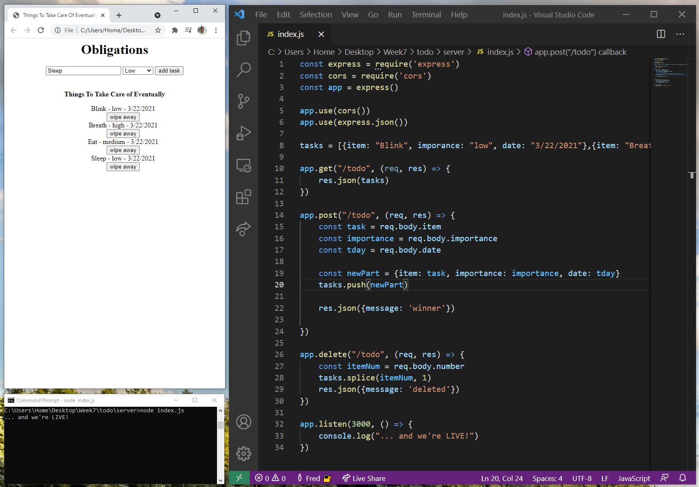
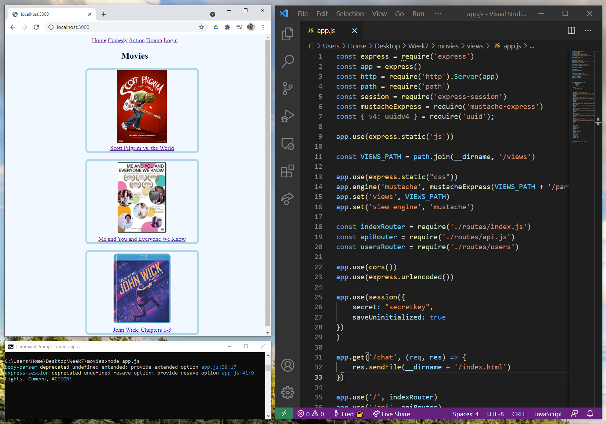

# Week7 - Back End - NodeJS - Server Side Pages

## To Do List
We've made a to do list a few times now. This time we set up the server side with a NodeJS server. We still had some client side scripting going on as this was early in the week.

## Movies Website
We had to display movie title, then create a link to show details. This was done with mustache and my first encounter with server sided pages. Learned about views, static resources, routing and sessions.

We did a login that was not secure as all the variables and arrays were locally saved. When we had this login we made pages that could only be reached when the session showed a user name (not secure, but one step at a time).

I spent some time that weekend checking if I could get this to run on my current web host. I got it to run, but only after spending a long time in the SSH shell and and using sftp to get files in places. I've heard about the VIM editor and I used it a bunch to make changes to files to get it working.

